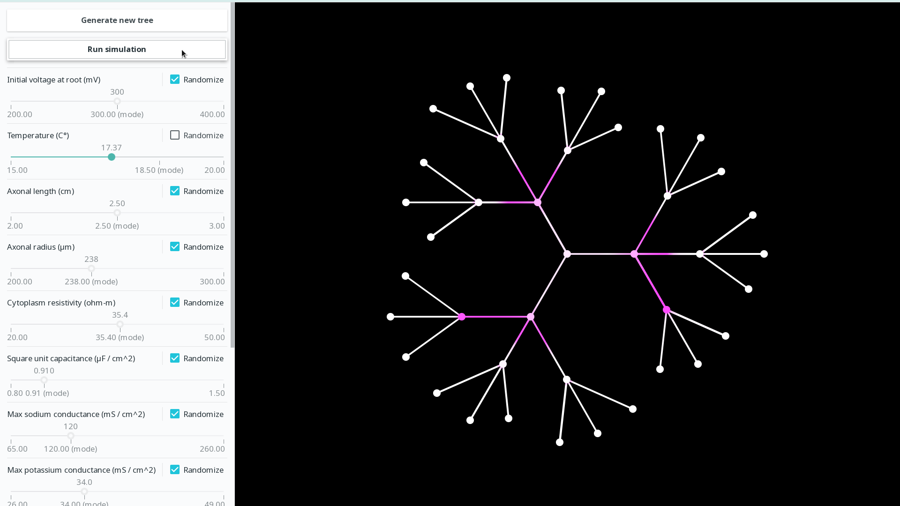

# neurons

This is a simulation of a biological neural network based on numeric solutions to the Hodgkin-Huxley equations.

It is based on chapters 2-4 and appendix B from the book [Neuroscience - A Mathematical Primer by Alwyn Scott](https://www.springer.com/gp/book/9780387954035).

## Notes

* The GUI itself is implemented using [GtkD](https://gtkd.org/). Because of this most of the code is somewhat object-oriented.

* The naming is purposefully verbose so that the code is as clear as possible.

* Here are some highlights from the code:
  * All the parameter metadata is specified using user-defined annotations in the [ParameterSet](./source/neurons/computation/parameter_set.d) struct.
  * The equations are solved numerically in the [simulateImpulse](./source/neurons/computation/impulse_simulation.d) function.
  * The [NeuralTreeSimulationWrapper](./source/neurons/computation/neural_tree_simulation_wrapper.d) creates a mutable container for the otherwise immutable [NeuralTreeSimulation](./source/neurons/computation/neural_tree_simulation.d) class. The latter is immutable because it is calculated in a separate thread and then shared. The former is mutable because once a new tree is generated we need to update its reference (or its wrapper's reference) in the GUI code.
  * A separate thread is launched using the [SimulationGenerator](./source/neurons/computation/simulation_generator.d) class for generating new neural trees without blocking the UI thread.
  * The tree painting happens in the [NeuralTreeCanvas](./source/neurons/gui/neural_tree_canvas.d) class.
