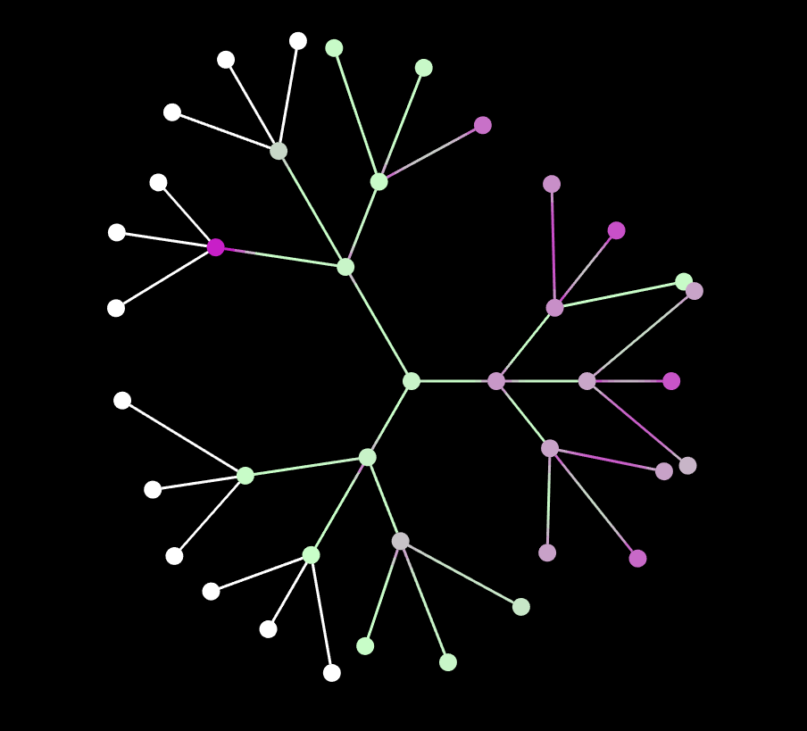

# Biological neural network simulation

__TODO__: Proper documentation

This is a program, which simulates an impulse passing through a small biological neuron network. The Hodgkin-Huxley model is used to find the impulse in each individual neuron.

The result of the impulse passing through each neuron is stored in .csv files under the results folder.

Variables in the .csvs:

* __v0__ - initial voltage that occupies 1/4 of the total length initially (mV)
* __vEnd__ - voltage in the end of the axon at time __tTotal__
* __temp__ - "Temperature (deg C)"
* __tTotal__ - "Total process time (ms)"
* __xTotal__ - "Lenght of the axon (cm)"
* __a__ - "Axonal radius (10^-4 m)"
* __rho__ - "Cytoplasm resistivity (ohm-m)"
* __cap__ - "Square unit capacitance (micro F/cm^2)"
* __gNa__ - "Maximal sodium conductance (mS/cm^2)"
* __gK__ - "Maximal potassium conductance (mS/cm^2)"
* __gL__ - "Maximal leakage conductance (mS/cm^2)"
* __vNa__ - "Sodium diffusion potential (mV)"
* __vK__ - "Potassium diffusion potential (mV)"
* __vL__ - "Leakage diffusion potential (mV)"

Icon made by Freepik from www.flaticon.com
